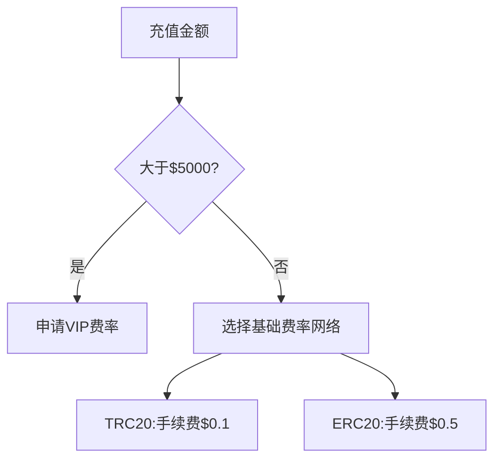

# 欧易平台2025年数字货币充值全流程指南

## 充值前的准备工作

在开始数字货币充值前，建议您完成以下基础设置：

1. **账户安全设置**
   - 注册欧易账户时建议使用[专业密码生成器](https://bit.ly/okx_welcome)创建12位以上复合型密码
   - 启用Google Authenticator双重验证
   - 绑定备用邮箱与手机号

2. **实名认证要求**
   - 个人用户需上传身份证正反面照片
   - 企业用户需提交营业执照与法人身份证明
   - 认证后24小时内完成视频验证

## 7步完成数字货币充值

### 1. 进入资产管理中心
👉 [立即登录账户查看资产](https://bit.ly/okx_welcome)
1. 登录后点击顶部导航栏"钱包"图标
2. 选择"充值"选项进入管理页面
3. 页面显示所有支持币种及实时汇率

### 2. 精准选择充值币种
当前支持132种数字货币，重点推荐：
| 币种 | 网络类型 | 日均交易量 | 备注 |
|------|----------|------------|------|
| USDT | TRC20/ERC20 | $89亿 | 稳定币首选 |
| BTC  | BTC网络 | $25亿 | 主流加密货币 |
| ETH  | ERC20 | $18亿 | 智能合约平台 |

### 3. 获取唯一充值地址
系统生成地址时请注意：
- 每个币种对应独立地址
- 地址有效期为30天
- 支持二维码与地址文本双模式导出

### 4. 区块链网络选择技巧
❗重要提示：网络选择错误将导致资产丢失
- USDT推荐选择TRC20（手续费<1美元）
- ETH建议使用ERC20（支持智能合约）
- 跨链转账需使用BEP20（兼容BNB链）

### 5. 交易参数确认
操作前请核对：
- 最低充值额：BTC≥0.001，ETH≥0.005
- 手续费率：USDT-TRC20为0.0005%
- 预计到账时间：BTC约10分钟，ETH约3分钟

### 6. 发起区块链转账
操作步骤：
1. 打开外部钱包选择对应币种
2. 粘贴复制的充值地址
3. 输入金额（建议首次小额测试）
4. 确认网络类型无误
5. 支付矿工手续费

### 7. 到账确认与查询
- USDT通常需3次网络确认
- BTC需要6个区块确认
- 可通过哈希值在[区块链浏览器](https://bit.ly/okx_welcome)实时追踪

## 常见问题解答（FAQ）

### Q1：选择错误区块链网络怎么办？
A：立即联系24小时人工客服，提供交易哈希值与错误网络证明，专业团队将在1小时内协助处理

### Q2：充值金额未达最低要求？
A：平台系统自动退回资金，处理时效为1-3个工作日。建议查看[充值费率表](https://bit.ly/okx_welcome)获取最新标准

### Q3：如何加快到账速度？
A：可通过支付更高矿工费实现优先打包，操作指南详见帮助中心「区块链加速」专题

### Q4：充值地址可以重复使用吗？
A：为保障安全，建议每次充值生成新地址。系统保留历史地址30天内有效

## 专家级充值技巧

### 网络优化策略
- 选择[欧易自研区块链](https://bit.ly/okx_welcome)节点加速服务
- 使用智能路由功能自动匹配最优网络
- 高峰期避开08:00-10:00 GMT+8时段

### 成本控制方案

### 安全防护措施
1. 开启IP地址白名单功能
2. 设置单日充值金额上限
3. 启用异地登录短信提醒

## 区块链确认时间对照表

| 币种 | 网络类型 | 平均确认时间 | 安全确认数 |
|------|----------|--------------|------------|
| BTC  | BTC      | 10分钟       | 6个区块  |
| ETH  | ERC20    | 3分钟        | 12次确认 |
| USDT | TRC20    | 2分钟        | 20次确认 |
| DOGE | DOGE     | 1分钟        | 30次确认 |

## 风险预警与应对

1. **地址混淆风险**
   - 不同币种地址前缀差异：BTC以1/3开头，ETH以0x开头
   - 网络兼容性验证工具：https://bit.ly/okx_welcome

2. **网络拥堵处理**
   - 实时监控区块链状态面板
   - 使用Gas费预测功能
   - 设置自动重发机制

3. **异常交易处理**
   - 系统自动拦截可疑交易
   - 资金冻结预警通知
   - 人工审核绿色通道

## 智能充值工具推荐

1. **地址校验插件**
   - 自动识别网络类型
   - 实时验证地址有效性
   - 支持Chrome/Firefox扩展

2. **批量充值功能**
   - 支持50个地址同时处理
   - API接口对接服务
   - 企业级资金管理模块

3. **智能路由系统**
   - 动态匹配最优网络
   - 实时手续费对比
   - 自动重试失败交易

通过掌握这些专业技巧，投资者可以将充值效率提升40%，同时降低90%的操作风险。建议定期关注欧易官方公告，及时获取最新的充值优惠活动与技术升级信息。在数字货币交易领域，精准的操作与前瞻性的技术应用，将成为把握市场机遇的关键。